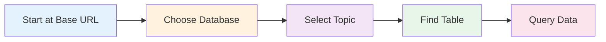

## Navigation Overview

Navigating the GSS StatsBank API is like exploring a file system - you start at the root and progressively drill down through databases and topics until you reach the table containing your desired data.



## Step-by-Step Navigation

### Step 1: Connect to the API Root

Begin by making a GET request to the base URL to retrieve the list of available databases:

```r
URL = "https://statsbank.statsghana.gov.gh:443/api/v1/en/"
request = request(URL)

response = request |> req_perform()
response |> resp_body_json()
```

<Note>
The response will contain a list of database objects, each with a `dbid` and `text` field identifying available databases.
</Note>

### Step 2: Select a Database

Append the database name to the URL path to view available topics:

```r
# Example: Exploring PHC 2021 StatsBank
request = request(URL) |> 
  req_url_path_append("PHC 2021 StatsBank")

response = request |> req_perform()
response |> resp_body_json()
```

**Response includes topics such as:**
- Population
- Water and Sanitation
- Education and Literacy
- Economic Activity
- Housing

<Info>
At the topic level and below, the API uses `id` (not `dbid`) to identify items.
</Info>

### Step 3: Select a Topic

Further append the topic name to view available tables:

```r
request = request(URL) |> 
  req_url_path_append("PHC 2021 StatsBank") |>
  req_url_path_append("Water and Sanitation")

response = request |> req_perform()
response |> resp_body_json()
```

**Response includes tables such as:**
- `waterDisposal_table.px`
- `mainwater_table.px`
- `toiletfacility_table.px`
- `timetaken.px`

### Step 4: Reach a Table

Append the table name (ending in `.px`) to access the table metadata:

```r
table_req = request(URL) |> 
  req_url_path_append("PHC 2021 StatsBank") |>
  req_url_path_append("Water and Sanitation") |>
  req_url_path_append("waterDisposal_table.px")

response = table_req |> req_perform()
metadata = response |> resp_body_json()
```

<Tip>
When you reach a table, the response changes from a list of navigation items to detailed metadata including available variables, their codes, and possible values.
</Tip>

## Automated Navigation Helper

To simplify navigation, you can create a helper function that builds URLs incrementally and displays available options at each level:

```r
build_url = function(URL, ...) {
    path = list(...)
    req = request(URL)
    
    # Add each folder name to the URL path incrementally
    full_req = purrr::reduce(path, req_url_path_append, .init = req)
    
    # Check if the last part of the path ends in ".px" (indicating a table)
    is_table = FALSE
    if (length(path) > 0) {
      if (grepl("\\.px$", path[[length(path)]], ignore.case = TRUE)) {
        is_table = TRUE
      }
    }

    # Fetch the content to see what is inside (GET request)
    response = req_perform(full_req)
    body = resp_body_json(response)

    if (is_table) {
        # If it is a table, print the variable names (metadata)
        message("Endpoint reached: Table found.")
        message("Available variables:")
        print(map_chr(body$variables, "code"))
    } else {
        # If it is a folder/database, list the children IDs
        key = if(length(path) == 0) "dbid" else "id"
        print(map_chr(body, key))
    }

    # Return the request object to be assigned to a variable
    return(full_req) 
}
```

### Using the Helper Function

<Accordion title="Explore Databases">
```r
# List all databases
build_url(URL)
```

**Output:**
```r
[1] "Annual Household Income and Expenditure Survey (AHIES)"
[2] "Education(Admin)"
[3] "Ghana Census of Agriculture (GCA)"
[4] "GLSS7"
[5] "PHC 2021 StatsBank"
[6] "PHC2010"
[7] "Trade"
```
</Accordion>

<Accordion title="Explore Topics in a Database">
```r
# List topics in PHC 2021
build_url(URL, "PHC 2021 StatsBank")
```

**Output:**
```r
[1] "Difficulties in Performing Activities"
[2] "Economic Activity"
[3] "Education and Literacy"
[4] "Fertility and Mortality"
[5] "Housing"
[6] "Water and Sanitation"
```
</Accordion>

<Accordion title="Explore Tables in a Topic">
```r
# List tables in Water and Sanitation
build_url(URL, "PHC 2021 StatsBank", "Water and Sanitation")
```

**Output:**
```r
[1] "defaecate_table.px"
[2] "domesticWater_table.px"
[3] "mainwater_table.px"
[4] "waterDisposal_table.px"
```
</Accordion>

<Accordion title="Reach a Table and View Variables">
```r
# Navigate to a specific table
table_req = build_url(URL, "PHC 2021 StatsBank", 
                      "Water and Sanitation", 
                      "waterDisposal_table.px")
```

**Output:**
```text
Endpoint reached: Table found.
Available variables:
[1] "WaterDisposal"   "Locality"        "Geographic_Area"
```
</Accordion>

## Identifying Table vs. Folder

You can determine whether you've reached a table or are still navigating folders:

| Indicator | Folder/Topic | Table |
|-----------|--------------|-------|
| File extension | No `.px` extension | Ends with `.px` |
| Response type | List of items with `id`/`dbid` | Object with `variables` array |
| HTTP method for data | N/A - navigation only | POST with query to retrieve data |

<Note>
Tables are the only endpoints where you can retrieve actual data. Databases and topics are purely for navigation.
</Note>

## Saving Your Navigation Path

Once you've navigated to a table, save the request object for later use:

```r
# Save the table request object
table_req = build_url(URL, 
                      "PHC 2021 StatsBank", 
                      "Water and Sanitation", 
                      "waterDisposal_table.px")

# Later, use it to query data
query_list = list(
  query = list(...),
  response = list(format = "csv")
)

data_response = table_req |> 
  req_body_json(query_list) |> 
  req_perform()
```

<Tip>
By saving the request object, you avoid having to reconstruct the URL path each time you want to query the table with different parameters.
</Tip>

## Navigation Best Practices

1. **Explore incrementally** - Navigate one level at a time to understand the structure
2. **Save request objects** - Store the table request object once you've navigated to your target
3. **Use helper functions** - Automate repetitive navigation with utility functions
4. **Check for `.px` extension** - This immediately tells you when you've reached a table
5. **Inspect metadata** - Always review table variables before constructing queries

## Common Navigation Patterns

<Accordion title="Exploratory Navigation">
When you're not sure what data is available:

```r
# Start broad
build_url(URL)

# Narrow down step by step
build_url(URL, "PHC 2021 StatsBank")
build_url(URL, "PHC 2021 StatsBank", "Water and Sanitation")

# Find your table
table_req = build_url(URL, "PHC 2021 StatsBank", 
                      "Water and Sanitation", 
                      "waterDisposal_table.px")
```
</Accordion>

<Accordion title="Direct Navigation">
When you know exactly which table you need:

```r
# Navigate directly to the table
table_req = request(URL) |>
  req_url_path_append("PHC 2021 StatsBank") |>
  req_url_path_append("Water and Sanitation") |>
  req_url_path_append("waterDisposal_table.px")

# Proceed to query
metadata = table_req |> req_perform() |> resp_body_json()
```
</Accordion>

## Next Steps

Once you've successfully navigated to a table:

1. **Inspect the metadata** to see available variables and their values
2. **Construct a query** specifying which variables and filters to apply
3. **Retrieve the data** using a POST request with your query

Learn more in the [Constructing Queries](/guides/constructing-queries) guide.