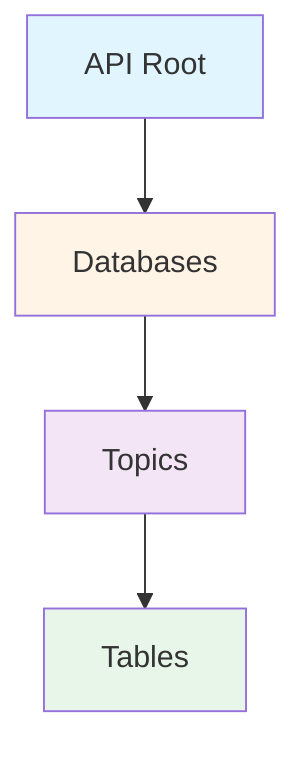

## Hierarchical Organization

The GSS StatsBank organizes statistical data in a three-level hierarchy:



<Info>
This structure mirrors a file system: Databases are like drives, Topics are like folders, and Tables are like files containing the actual data.
</Info>

## Level 1: Databases

Databases represent major surveys, censuses, or data collection programs. Each database contains related statistical information organized by topic.

### Available Databases

The GSS StatsBank includes several databases:

| Database | Description |
|----------|-------------|
| **PHC 2021 StatsBank** | 2021 Population and Housing Census data |
| **PHC2010** | 2010 Population and Housing Census data |
| **GLSS7** | Ghana Living Standards Survey Round 7 |
| **Ghana Census of Agriculture (GCA)** | Agricultural census data |
| **Annual Household Income and Expenditure Survey (AHIES)** | Household income and expenditure statistics |
| **Macro Economic Indicators** | Economic indicators and statistics |
| **Education(Admin)** | Educational administrative data |
| **Trade** | Trade statistics |

<Note>
To retrieve the current list of databases, make a GET request to the API base URL:

```r
URL = "https://statsbank.statsghana.gov.gh:443/api/v1/en/"
response = request(URL) |> req_perform()
response |> resp_body_json()
```
</Note>

## Level 2: Topics

Within each database, data is organized into thematic topics. Topics group related tables together for easier navigation.

### Example: PHC 2021 StatsBank Topics

The 2021 Population and Housing Census database contains these topics:

<Accordion title="Population and Demographics">
- **Population** - Population counts, distributions, and characteristics
- **Fertility and Mortality** - Birth rates, death rates, and related statistics
- **Human Development Indicators** - HDI components and related metrics
</Accordion>

<Accordion title="Socioeconomic Indicators">
- **Economic Activity** - Employment, occupation, and labor force data
- **Education and Literacy** - Educational attainment and literacy rates
- **Multidimensional Poverty** - Poverty indices and measurements
</Accordion>

<Accordion title="Housing and Living Conditions">
- **Housing** - Housing characteristics and conditions
- **Water and Sanitation** - Access to water sources, sanitation facilities, and waste disposal
- **Structures** - Building and structure characteristics
</Accordion>

<Accordion title="Other Topics">
- **ICT** - Information and Communication Technology access and usage
- **Difficulties in Performing Activities** - Disability and functional difficulty data
</Accordion>

<Tip>
To explore topics within a database, append the database name to the base URL:

```r
build_url(URL, "PHC 2021 StatsBank")
```
</Tip>

## Level 3: Tables

Tables contain the actual statistical data. Each table focuses on specific variables and can be queried with filters to extract the exact data you need.

### Table Identification

Tables are identified by:
- The `.px` file extension
- A descriptive name indicating the table's content

### Example: Water and Sanitation Tables

The "Water and Sanitation" topic contains multiple tables:

| Table Name | Description |
|------------|-------------|
| `waterDisposal_table.px` | Methods of liquid waste disposal |
| `mainwater_table.px` | Main sources of drinking water |
| `domesticWater_table.px` | Domestic water usage |
| `toiletfacility_table.px` | Toilet facility types and access |
| `toilettype_table.px` | Classification of toilet types |
| `solidDisposal_table.px` | Solid waste disposal methods |
| `storage_table.px` | Water storage methods |
| `timetaken.px` | Time taken to fetch water |

<Note>
Each table contains specific variables (dimensions) that can be filtered and selected when querying the data.
</Note>

## Navigation Path Example

To access data about water disposal methods:

```
Base URL: https://statsbank.statsghana.gov.gh:443/api/v1/en/
    ↓
Database: PHC 2021 StatsBank
    ↓
Topic: Water and Sanitation
    ↓
Table: waterDisposal_table.px
```

Complete path:
```
https://statsbank.statsghana.gov.gh:443/api/v1/en/PHC%202021%20StatsBank/Water%20and%20Sanitation/waterDisposal_table.px
```

## Response Format Differences

The API returns different response structures depending on the level:

<Accordion title="Database Level (Root)">
**Key used:** `dbid`

```json
[
  {
    "dbid": "PHC 2021 StatsBank",
    "text": "PHC 2021 StatsBank"
  }
]
```
</Accordion>

<Accordion title="Topic Level (Sub-levels)">
**Key used:** `id`

```json
[
  {
    "id": "Water and Sanitation",
    "text": "Water and Sanitation"
  }
]
```
</Accordion>

<Accordion title="Table Level (Endpoints)">
**Returns:** Metadata including variables, values, and table metadata

```json
{
  "variables": [
    {
      "code": "WaterDisposal",
      "values": [...],
      "valueTexts": [...]
    }
  ]
}
```
</Accordion>

<Info>
This structural difference is important when programmatically navigating the API - use `dbid` at the root level and `id` for all sub-levels.
</Info>